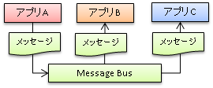
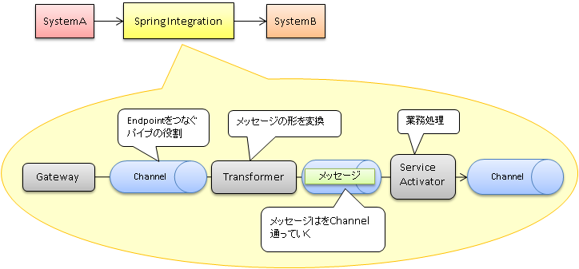

# [システム間連携を担うSpring Integrationのエンタープライズ開発での活用]
## 概要
既存システム活用のためのシステム間連携技術「Spring Integration」の使い方

## このセッションに関連するキーワード
Spring Integration

## セッションの内容
近年はオンプレとクラウドの連携が増加しており、連携のベストプラクティスをまとめた書籍Enterprise integration patternでは「非同期メッセージング」を用いた連携を推奨している。  
ただし、この書籍には実装については触れられていない。  
Spring Integrationを利用することで「非同期メッセージング」を実装ができるようになる。

 

（↑図の要素について）  
（参考）Busについて  
Busはメッセージングを「非同期を前提としたアプリケーション間連携の標準フレームワーク」とのこと  
https://www.atmarkit.co.jp/fdotnet/special/realsoa02/realsoa02_02.html  
（参考）非同期メッセージングの簡単な説明  
https://ledsun.hatenablog.com/entry/2013/07/18/181044

## システム間を非同期メッセージングで連携を行う
Spring Integrationではサーバ間の連携を「Message」として扱い、
メッセージ間を「Channel」で繋ぐという概念がある。

### 登場人物
  * Message(Header/Payload)
 HeanderとPayload(xml,json,java.Stringとか)で構成
   * Channel
 Endpointをつなぐパイプの役割
  * Endpoint
 始点/終点の役割、メッセージフロー内部では業務処理等

### 実装のおおまかな流れ
 1. pom.xmlで依存関係を設定  
 2. mainメソッド作成
 3. spring-integration.xmlの設定(input-channelと output-channelの定義など)

### 実際に合った問題点/解決方法
| 問題 | 対処 |
| ----|---- | 
| 連携コンポーネントが増えすぎた | 業務処理のみの違いのときは共通化を実施 |
| Endpointが増えすぎた| パーツ化（いくつかのエンドポイント間の処理をまとめるかんじでした）|
| ログ出力が複雑 | Interceptorを利用 |
| ServiceActivatorを作るのが大変 | 拡張クラスを作成し、メタ情報部分を外だしする |

## 考察したこと
* iPasSのboomiを触ったので、そのソースコード版のようなものと感じました。
システム間連携のための実装をするため、業務アプリケーションを作成するよりは書き方が決まっている印象を受けました。  
自分で連携する内容を作成するため、かゆいところにも手が届くような連携が可能なのではと思いました。
* 関連システムが増えれば増えるほど、同じものようなメッセージフローが沢山作成されるということから、  
積極的に共通化する箇所を見つけなければならないと分かりました（GUIのツールを使う場合でも同様）。

## 疑問点
* 複数のサーバ間の連携を新しく入れ替える場合、どうやって実施していくのか気になりました。
本番試験も簡単にできそうに思えないです。
* UTの仕方が気になりました。また、ST試験から急に準備や試験内容の難易度が上がりそうです。  
→UTはSpring Bootのテストがサポートしていました。試験しやすいようになっている印象です。
https://spring.io/guides/gs/integration/
* これを実装するのはアプリケーション側なのか、環境側なのか、線引きが私の中で曖昧です。

## 講義資料URL
(Enterprise integration pattern)  
https://en.wikipedia.org/wiki/Enterprise_Integration_Patterns  
(Spring Integration)  
https://spring.io/projects/spring-integration  
https://qiita.com/akichikn/items/63cb9b82212b6e046419
